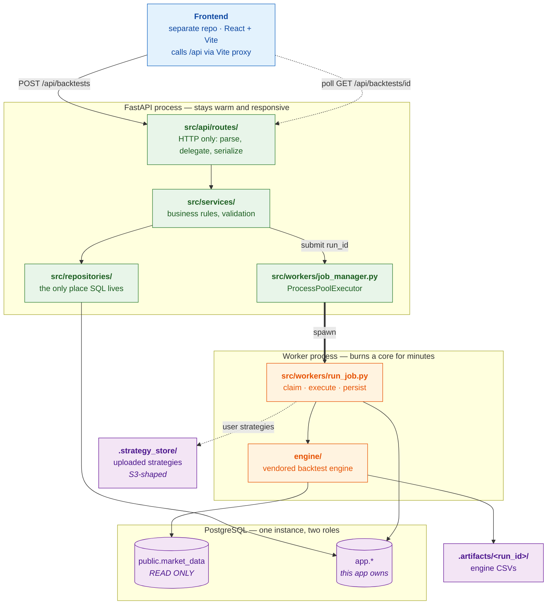
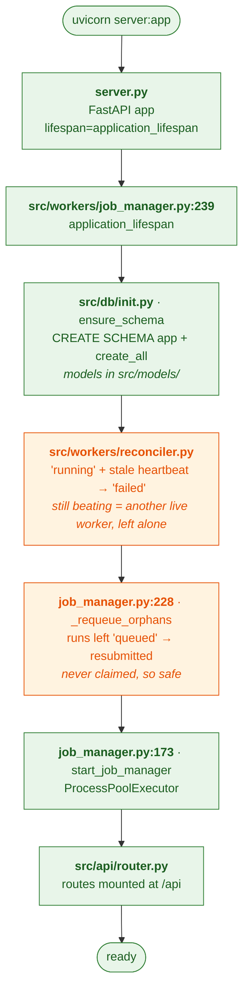
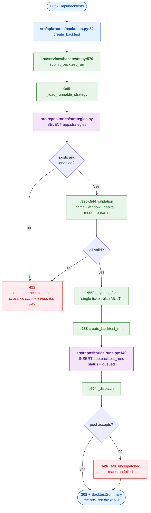
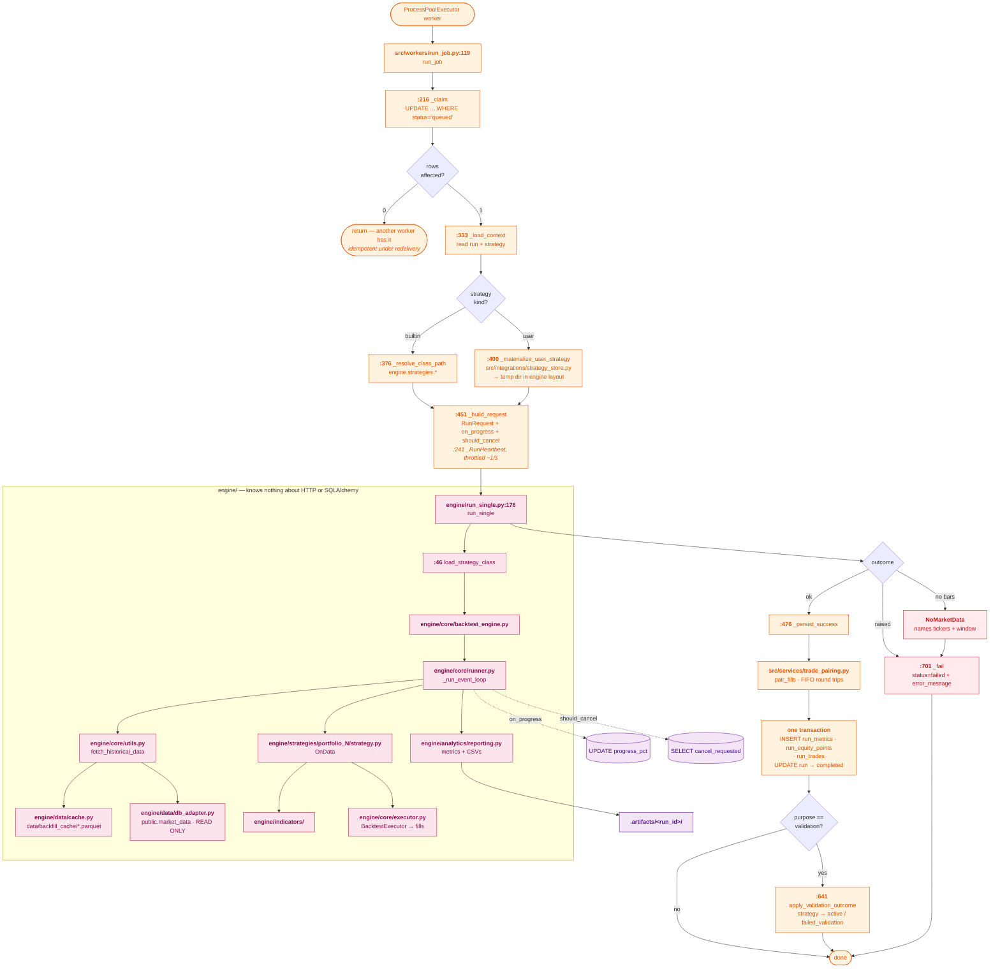
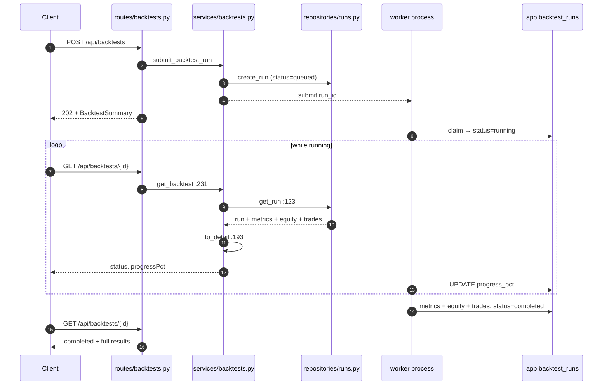
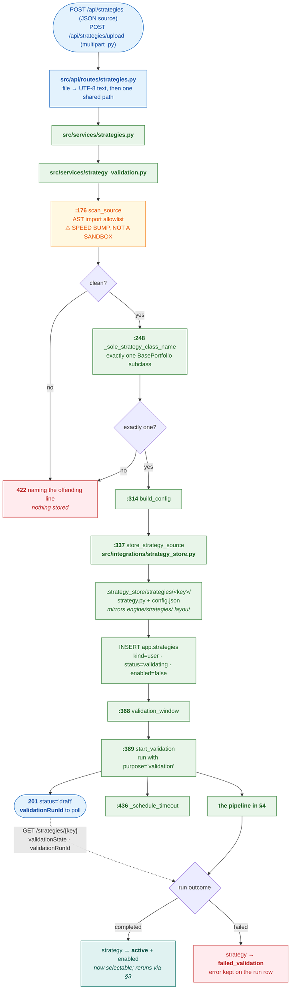
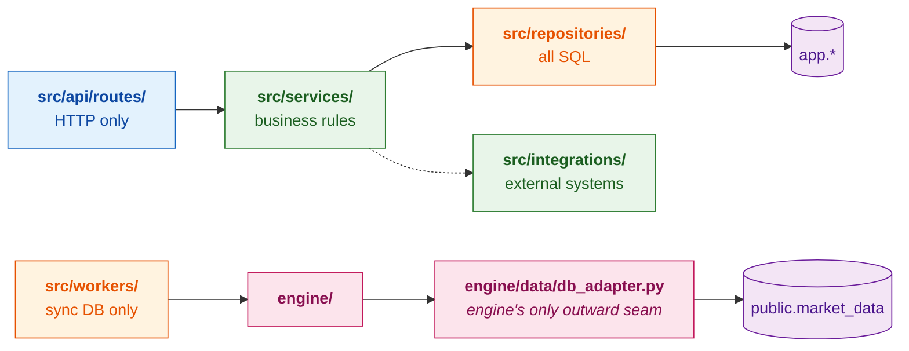

# Architecture Flow

Where a request enters, what it touches, and where it ends up — traced against
the code, with `file:line` references you can click.

Every diagram below is Mermaid, so GitHub renders it inline.

**Read this first:** the one fact that shapes the whole design is that a
backtest is **minutes of single-core CPU work, not a request**. Everything
downstream — the 202 response, the process pool, the polling, the progress
column — follows from that.

- [1. System overview](#1-system-overview)
- [2. Startup](#2-startup)
- [3. Submitting a run](#3-submitting-a-run)
- [4. Worker execution](#4-worker-execution)
- [5. Reading results](#5-reading-results)
- [6. Uploading a strategy](#6-uploading-a-strategy)
- [7. Layering rules](#7-layering-rules)
- [8. File map](#8-file-map)

---

## 1. System overview



The **double arrow** is the process boundary. It is the whole reason the API
can answer other requests while a backtest runs.

---

## 2. Startup

`uvicorn server:app` → everything below happens once, in order, before the
first request is served.



Two things are deliberate and easy to break:

**Order matters.** The reconciler runs *after* schema creation — it corrects
rows in tables that must already exist.

**The pool is built in the lifespan and nowhere else.** On Windows a process
pool *spawns* workers by re-importing the module tree. A pool built at import
time would rebuild itself inside every worker it created; under `--reload` the
first file save turns that into a fork bomb. A lifespan runs once per real
server process and never inside a spawned worker.

**The reconciler judges by heartbeat, not by status.** `status='running'` only
says a worker claimed the row; whether that worker is alive is what
`heartbeat_at` answers. Each worker beats every few seconds on a thread
independent of engine progress — progress callbacks stop for minutes during a
cold `market_data` load, so they cannot serve as liveness. A boot fails only
rows whose beat is stale, which is what lets two API instances, a rolling
deploy, or two test modules in one process coexist without killing each
other's runs.

---

## 3. Submitting a run



**Why 202 carries the full summary** rather than just an id: the client drops
it straight into its list cache, so the new run appears immediately instead of
after a refetch.

**A 202 is not a promise of success** — only that the run exists and is the
client's to watch. If the pool refuses the job outright, the payload comes back
already marked `failed`, because a run nothing will ever pick up must not look
like a run waiting its turn.

---

## 4. Worker execution

This is where the actual backtest happens, in a separate OS process.



Four correctness rules live in this diagram, each guarding a specific failure:

| Rule | Without it |
| --- | --- |
| Claim with `WHERE status='queued'` | A redelivered job runs twice concurrently |
| Progress writes throttled to ~1/sec | A long run hammers the database for cosmetic updates |
| Equity curve downsampled to daily before insert | ~98k rows stored for a chart that plots trading days |
| Empty bars raise `NoMarketData`, exceptions re-raise | A crashed run reports **success with no results** |

That last one is the important one. Upstream in MQSMaster, `run()` catches
per-portfolio exceptions, logs them, and returns an empty trade log — correct
for a batch CLI where a human reads the console, fatal for a hosted API.

---

## 5. Reading results

The client polls while `status` is non-terminal.



`BacktestDetail` carries two fields the list row does not: **`progressPct`**
(drives the progress bar) and **`errorMessage`** (the only place a failed — or
cancelled — run can say why it stopped). Both are additive; the client's Zod
schema ignores keys it does not declare, so they shipped safely ahead of the UI.

---

## 6. Uploading a strategy

A strategy is proven compatible **by running a real backtest on it**. The
validation run goes through the pipeline in §4 unchanged — same worker, same
progress, same error reporting.



**Watching an upload.** The catalogue (`GET /strategies`) shows only enabled
rows, so a validating or failed upload is invisible there by design. The
client watches it through `GET /strategies/{key}` — `validationState` carries
the real lifecycle and `validationRunId` is the run to open for a progress bar
or, on failure, the reason — and `POST /strategies/check` (or `/upload/check`)
answers "would this run here?" in milliseconds before anything is submitted.

**The layout mirroring is load-bearing, not cosmetic.** `BasePortfolio` finds
its `config.json` by looking next to its `strategy.py`
(`inspect.getfile` sibling lookup), so a materialized upload must land in that
exact shape for the engine to load it with no special-casing.

> **Security.** Validation executes user-supplied Python in a worker process
> holding credentials to the production trading database. The AST allowlist and
> the timeout are speed bumps a determined author walks around — they are not
> isolation. Real containment (container, no network egress, a scoped database
> role) is required before this is exposed beyond the club.

---

## 7. Layering rules

Enforced by review, and checkable with grep.



| Invariant | Check |
| --- | --- |
| `engine/` imports nothing from `src/` | `grep -rn "^\s*\(from\|import\)\s\+src\." engine/` → 0 |
| No web framework or ORM in `engine/` | `grep -rln "fastapi\|sqlalchemy" engine/` → 0 |
| Routes never touch the ORM | `grep -rln "sqlalchemy" src/api/` → 0 |
| Routes never import the engine | `grep -rn "^\s*from engine" src/api/` → 0 |

The engine staying free of `src` is what keeps it runnable standalone — and what
would make swapping it for a pip-installed package a one-line change.

---

## 8. File map

Ordered the way a request travels.

| Stage | File | Role |
| --- | --- | --- |
| Boot | [server.py](../server.py) | ASGI app, CORS, lifespan wiring |
| Boot | [src/workers/job_manager.py](../src/workers/job_manager.py) | Pool, `application_lifespan`, orphan requeue |
| Boot | [src/db/init.py](../src/db/init.py) | `CREATE SCHEMA app` + `create_all` |
| Boot | [src/workers/reconciler.py](../src/workers/reconciler.py) | Interrupted runs → `failed` |
| Config | [src/core/config.py](../src/core/config.py) | The only module reading the environment |
| HTTP | [src/api/router.py](../src/api/router.py) | Mounts everything under `/api` |
| HTTP | [src/api/routes/backtests.py](../src/api/routes/backtests.py) | List, submit, detail, delete/cancel |
| HTTP | [src/api/routes/strategies.py](../src/api/routes/strategies.py) | Catalogue, upload |
| HTTP | [src/api/routes/portfolios.py](../src/api/routes/portfolios.py) | `/live/*` — **sample data**, out of scope |
| HTTP | [src/api/routes/system.py](../src/api/routes/system.py) | `/live/*` — **sample data**, out of scope |
| Contract | [src/schemas/](../src/schemas) | Pydantic models; camelCase mirrors the FE Zod types |
| Logic | [src/services/backtests.py](../src/services/backtests.py) | Validation, submission, detail assembly |
| Logic | [src/services/strategy_validation.py](../src/services/strategy_validation.py) | AST scan, store, validation run |
| Logic | [src/services/trade_pairing.py](../src/services/trade_pairing.py) | Fills → FIFO round trips |
| Data | [src/repositories/](../src/repositories) | All SQL; `for_user()` seam awaits auth |
| Data | [src/models/](../src/models) | ORM models for the `app` schema |
| External | [src/integrations/strategy_store.py](../src/integrations/strategy_store.py) | S3-shaped store, local backend |
| Execution | [src/workers/run_job.py](../src/workers/run_job.py) | Claim, run, persist, validation outcome |
| Engine | [engine/run_single.py](../engine/run_single.py) | The seam: one run in, `RunResult` out |
| Engine | [engine/core/](../engine/core) | Simulation kernel, event loop, executor |
| Engine | [engine/analytics/](../engine/analytics) | Metrics, reporting, vectorized mode |
| Engine | [engine/data/](../engine/data) | Parquet cache + database adapter |
| Engine | [engine/strategies/](../engine/strategies) | Strategy classes + their `config.json` |
| Engine | [engine/indicators/](../engine/indicators) | Loaded dynamically by name |
| Engine | [engine/contracts/](../engine/contracts) | `RunRequest`, `RunResult`, errors |

### Where things land on disk

```
.artifacts/<run_id>/          engine CSVs for one run          (gitignored)
data/backfill_cache/*.parquet market data cache, one per ticker (gitignored)
.strategy_store/strategies/   uploaded strategy source          (gitignored)
```

---

## Known limitations

| Limitation | Consequence |
| --- | --- |
| `mode: "fast"` is unusable | Only `event` runs. `_build_fast_portfolio_stub` does `int(PORTFOLIO_ID)`, which raises on non-numeric ids |
| OMS not vendored | All four vendored strategies have it disabled, so no behavioural difference today |
| `TLT` bars end 2025-11-07 | Caps the window for any strategy whose universe includes it |
| No authentication | `owner_id` exists on every run and `for_user()` is wired through the repositories, but nothing enforces ownership yet |
| `/live/*` is sample data | The live trading views are not backed by the trading tables |
