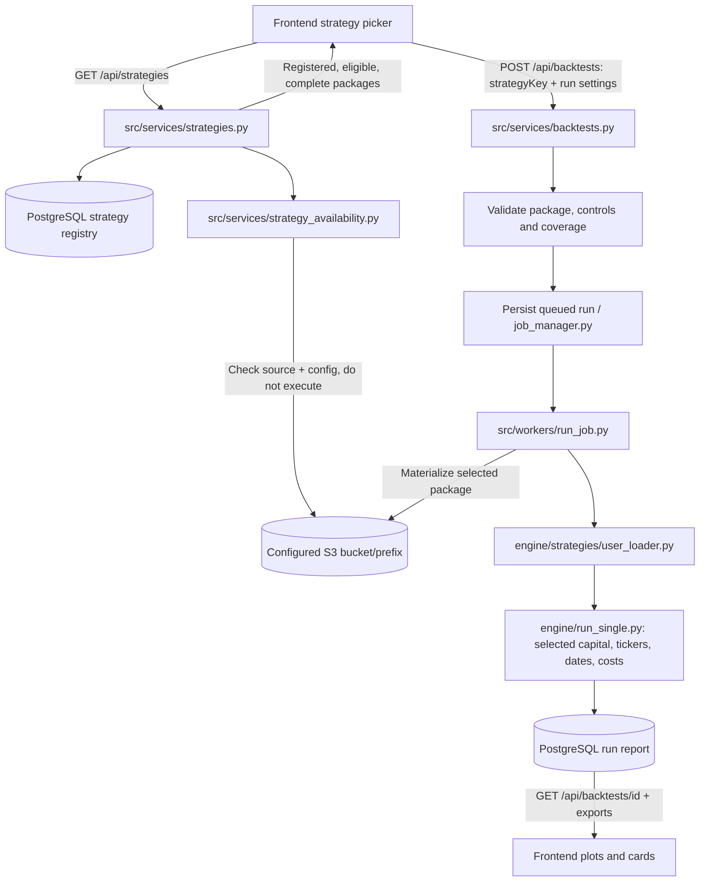

# S3 strategies and terminal logging

## Start the backend with visible logs

From the repository root, stop the existing server with Ctrl+C, then run:

```powershell
$env:LOG_LEVEL = 'INFO'
.\venv\Scripts\python.exe -X faulthandler -u -m uvicorn server:app --host 127.0.0.1 --port 8000 --log-level info
```

Keep the terminal open and stop the server with Ctrl+C. This omits `--reload`:
another code edit can interrupt a worker, and its supervisor can retain the
port if the application child crashes. Faulthandler prints native-crash thread
stacks. Restart after changing code or `.env`. The Windows helper
`scripts/start-dev-api.ps1` runs the same foreground command; its explicit
`-Background` option redirects output to timestamped files under `logs/`.

Application and spawned-worker logs use the same console format: timestamp,
level, process ID, logger, stage and context. INFO shows each workflow stage
and percentage/stage changes; it does not print every price bar or repeated
identical progress callback. Uvicorn's `--log-level` alone does not set the
application's level: use `LOG_LEVEL=INFO` too.

| Stage | What it tells you |
| --- | --- |
| `STARTUP`, `READY` | Database initialization and worker-pool startup completed. |
| `HTTP IN` / `HTTP OUT` | Request arrived; response status and elapsed milliseconds. `X-Request-ID` links the response to these logs. |
| `CATALOGUE`, `STORAGE CHECK` | Registry was read and each package checked for source/config in the selected store. |
| `SUBMIT`, `COVERAGE`, `REJECTED` | Selected capital/tickers/costs, available dates, or why submission was refused. |
| `QUEUED`, `WORKER` | Run ID persisted, submitted to the process pool and claimed. |
| `STORAGE FETCH` | Worker downloaded the selected strategy package and loaded its class. |
| `ENGINE`, `PROGRESS` | Execution started, stage/percentage changed, or the engine finished. |
| `PERSIST`, `COMPLETED` | Report observations/fills were saved; results can be read and exported. |
| Errors / cancellation / `SHUTDOWN` | Failed operation, cancellation or process shutdown; worker failures include the run ID. |

HTTP logs omit query strings, headers and request bodies. New package checks
log keys and timing, never Python source or configuration contents. Do not
enable third-party SDK wire debugging or share entire terminal logs publicly:
strategy-generated output and existing exception traces may contain sensitive
information.

If clicking Run produces **no `HTTP IN`**, first check the frontend connection:
`VITE_USE_FIXTURES=false`, `VITE_API_BASE_URL=/api`, and
`DEV_API_PROXY_TARGET=http://127.0.0.1:8000`; restart Vite after changing them.
Visit `/api/health` through the frontend's own origin. A failed health proxy is
a connection issue, not an engine failure. See [frontend setup](../README.md#connect-the-frontend-to-the-real-api).

## Publish the two built-in portfolios

Configure the existing bucket, prefix, region and AWS credentials/role using
the settings in `.env.example`. The script requires `STRATEGY_STORE_BACKEND=s3`.
It does not create a bucket or change IAM.

```powershell
# Read-only inventory and validation first:
.\venv\Scripts\python.exe scripts/publish_builtin_strategies.py
# Publish and byte-verify, then update the existing registry IDs:
.\venv\Scripts\python.exe scripts/publish_builtin_strategies.py --apply
```

The supported source packages are `engine/strategies/portfolio_1/` and
`engine/strategies/portfolio_2/`. Each contributes unchanged `strategy.py` and
`config.json` under `<configured-prefix>/strategies/<portfolio-id>/` in S3.
Deploy the storage-aware worker before publishing; wait for these portfolios'
queued/running jobs to finish. Existing unequal S3 contents are rejected, not
overwritten. Equal/partial publication can be retried. Local originals and
existing run history remain intact. If publication fails before registration,
inspect the error and rerun the dry-run; do not delete objects blindly.

The registry keeps `portfolio_1` / `portfolio_2`, their names and historical
foreign keys. `storage_key` selects their stored package. No new database
table or schema migration is required. The ordinary seeder leaves already
published entries unchanged.

## Request-to-report flow



The registry remains the validation catalogue. Arbitrary objects placed in S3
do not become runnable strategies; draft/disabled entries are not normal active
picker options. In S3 mode, missing/incomplete packages are omitted from the
catalogue and direct run submission is rejected. Storage outages return an
error, not an empty successful catalogue or sample strategies.

The worker fetches the stored package even when a built-in retains a local
`class_path`. It does not silently fall back to local source when S3 fails.
User-selected `initialCapital`, dates, `params.universe`, `slippageBps` and
`commissionPerShare` apply to that run. A changed universe receives equal
configured weights; this does not rewrite the strategy's own signal or sizing
logic. Overrides never modify the shared S3 package.

Successful reports record `reportMetadata.strategySource`: store backend,
storage key, and SHA-256 hashes of the downloaded source/config bytes before
execution. This is provenance, not a security guarantee or a pinned S3 version.
Older reports need not contain it. See [report contract](REPORT_CONTRACT.md).

For database-backed prices, coverage boundaries use the existing
`(ticker, timestamp)` index, returning stored exchange dates. Newly listed
tickers can shorten the shared window; the backend checks the intersection
for the selected universe. The frontend no longer substitutes demo coverage
or demo strategies when these real API calls fail.

Authentication/ownership enforcement and safe execution isolation remain
separate release requirements. Passing a backtest is not a Python sandbox.

## Focused regression checks

```powershell
.\venv\Scripts\python.exe -m pytest -q -m 'not db and not ci_db' tests/unit/test_pipeline_logging.py tests/unit/test_s3_builtin_pipeline.py
```

These tests use mocked storage/database seams and Moto S3; they do not publish
to the real bucket. The publication script and an explicit API run are separate
live checks. Development runs may legitimately have no trades.
